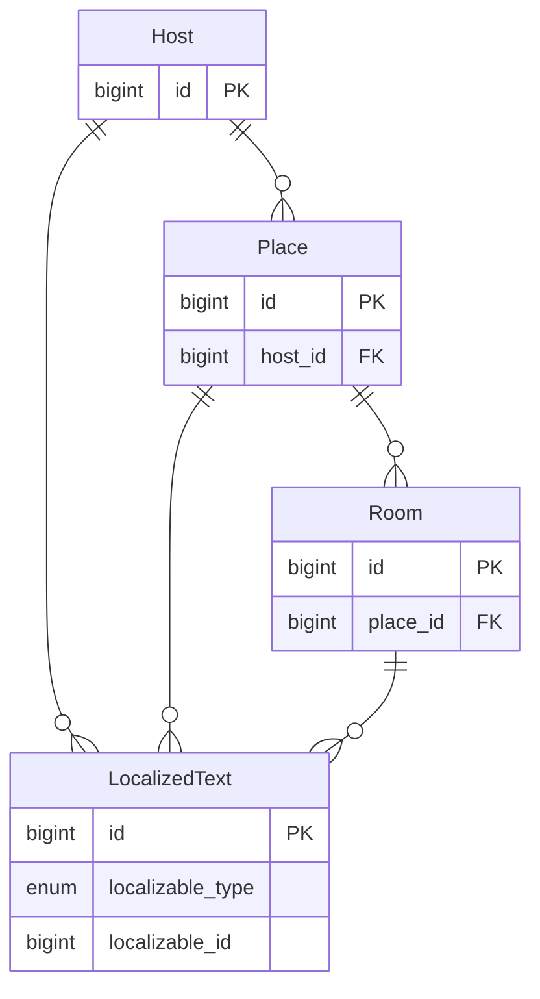
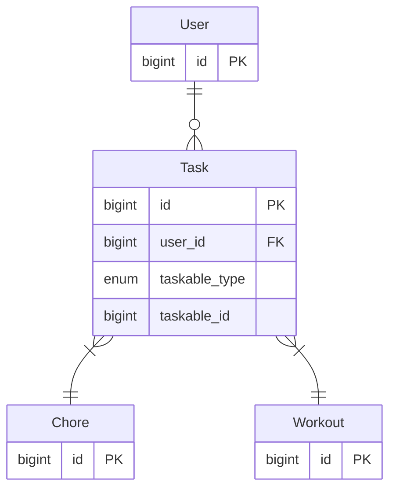

# polymorphism

A polymorphic BelongsTo association links one model to several models. At the database level, this is different from a standard foreign key reference because a single table references records in multiple tables. In addition to a foreign key, the polymorphic table also stores a foreign key type corresponding to the class name of models that the polymorphic BelongsTo association can reference.

## Example: LocalizedTexts

:::info
This example is a modified version of the domain model used in the [BearBnB](/docs/tutorials/bearbnb/overview) tutorial.
:::

In an application where multiple models may have localized text (text in multiple languages), one can keep DRY by using a polymorphic LocalizedText model with a BelongsTo association that points to several models.

Consider the following example in which:

- a Host has an “about” page with “title” and a “bio”
- a Place has a “title” and a “description”
- a Room also has a “title” and a “description”

A single LocalizedText model can be used to represent LocalizedText for all of these different use cases (the names of the fields passed to the front end can be [customized during serialization](/docs/serializers/attributes#renaming-attributes-with-as)). The following entity relationship diagram (ERD) represents how each of these models is associated with LocalizedText:



And this is the way the associations are modeled in Dream:

```ts
//////////
// Host //
//////////
export default class Host extends ApplicationModel {
  public override get table() {
    return 'hosts' as const
  }

  @deco.HasMany('Place', { dependent: 'destroy' })
  public places: Place[]

  @deco.HasMany('LocalizedText', {
    polymorphic: true,
    on: 'localizableId',
    dependent: 'destroy',
  })
  public localizedTexts: LocalizedText[]
}
//////////////
// end:Host //
//////////////

///////////
// Place //
///////////
export default class Place extends ApplicationModel {
  public override get table() {
    return 'places' as const
  }

  @deco.BelongsTo('Host')
  public hosts: Host[]

  @deco.HasMany('Room', {
    order: 'position',
    dependent: 'destroy',
  })
  public rooms: Room[]

  @deco.HasMany('LocalizedText', {
    polymorphic: true,
    on: 'localizableId',
    dependent: 'destroy',
  })
  public localizedTexts: LocalizedText[]
}
///////////////
// end:Place //
///////////////

//////////
// Room //
//////////
export default class Room extends ApplicationModel {
  public override get table() {
    return 'rooms' as const
  }

  @deco.BelongsTo('Place')
  public place: Place
  public placeId: DreamColumn<Room, 'placeId'>

  @deco.HasMany('LocalizedText', {
    polymorphic: true,
    on: 'localizableId',
    dependent: 'destroy',
  })
  public localizedTexts: LocalizedText[]
}
//////////////
// end:Room //
//////////////
```

Polymorphic associations can be created the same as regular associations:

```ts
const localizedText = LocalizedText.create({ localizable: host, locale: 'en-US', title: 'My title' })
// OR
const localizedText = host.createAssociation('localizedTexts', { locale: 'en-US', title: 'My title' })

// Both ways of creating the association automatically set localizableId and localizableType
// on the created LocalizedText:
console.log(localizedText.localizableId)
// <the id of the Host>
console.log(localizedText.localizableType)
// "Host"
```

From the perspective of the HasMany association, the `localizedTexts` has no restrictions and can be used like any other association:

```ts
const locale = 'en-US'
const host = await Host.leftJoinPreload('places', 'localizedTexts as ptxt', { and: { locale } })
  .leftJoinPreload('places', 'rooms', 'localizedTexts as rtxt', { and: { locale } })
  .findOrFail(hostId)
```

Here is the migration that created the `localized_texts` table:

```ts
import { Kysely, sql } from 'kysely'

// eslint-disable-next-line @typescript-eslint/no-explicit-any
export async function up(db: Kysely<any>): Promise<void> {
  await db.schema.createType('localized_types_enum').asEnum(['Host', 'Place', 'Room']).execute()

  await db.schema.createType('locales_enum').asEnum(['en-US', 'es-ES']).execute()

  await db.schema
    .createTable('localized_texts')
    .addColumn('id', 'bigserial', col => col.primaryKey())
    // Always use an enum for the foreign key type field to ensure that only supported
    // class names can be stored in the database
    .addColumn('localizable_type', sql`localized_types_enum`, col => col.notNull())
    .addColumn('localizable_id', 'bigint', col => col.notNull())
    .addColumn('locale', sql`locales_enum`, col => col.notNull())
    .addColumn('title', 'varchar(255)')
    .addColumn('markdown', 'text')
    .addColumn('deleted_at', 'timestamp')
    .addColumn('created_at', 'timestamp', col => col.notNull())
    .addColumn('updated_at', 'timestamp', col => col.notNull())
    .execute()

  await db.schema
    .createIndex('localized_texts_localizable_for_locale')
    .on('localized_texts')
    .columns(['localizable_type', 'localizable_id', 'locale'])
    .unique()
    .execute()
}

// eslint-disable-next-line @typescript-eslint/no-explicit-any
export async function down(db: Kysely<any>): Promise<void> {
  await db.schema.dropTable('localized_texts').execute()

  await db.schema.dropType('localized_types_enum').execute()
  await db.schema.dropType('locales_enum').execute()
}
```

## Example: Tasks

Another use case for polymorphismm is when creating a Task list from different types of things. If the things could be considered variants of the same type of thing, consider using [single table inheritance (STI)](/docs/models/sti) instead since polymorphic associations have [some caveats](#caveats) and cannot leverage table enforced foreign key references.

In this example, the application has Chores and Workouts, each of which is a distinct entity, so they are represented as separate models backed by separate tables. Users can have lists of Tasks that include both Chores and Workouts. The following entity relationship diagram (ERD) models this domain:



And this is the way the associations are modeled in Dream:

```ts
//////////
// User //
//////////
export default class User extends ApplicationModel {
  public override get table() {
    return 'users' as const
  }

  @deco.HasMany('Task')
  public tasks: Task[]

  @deco.HasMany('Chore', {
    through: 'tasks',
    source: 'taskable',
  })
  public chores: Chore[]

  @deco.HasOne('Chore', {
    through: 'tasks',
    source: 'taskable',
    and: { favorite: true },
  })
  public favoriteChore: Chore | null
}
//////////////
// end:User //
//////////////

//////////
// Task //
//////////
export default class Task extends ApplicationModel {
  public override get table() {
    return 'tasks' as const
  }

  @deco.BelongsTo('User', { on: 'userId' })
  public user: User
  public userId: DreamColumn<Task, 'userId'>

  @deco.BelongsTo(['Chore', 'Workout'], {
    polymorphic: true,
    on: 'taskableId',
  })
  public taskable: Chore | Workout
  public taskableId: DreamColumn<Task, 'taskableId'>
  public taskableType: DreamColumn<Task, 'taskableType'>
}
//////////////
// end:Task //
//////////////

///////////
// Chore //
///////////
export default class Chore extends ApplicationModel {
  public override get table() {
    return 'chores' as const
  }

  @deco.HasMany('Polymorphic/Task', { polymorphic: true, on: 'taskableId' })
  public tasks: PolymorphicTask[]
}
///////////////
// end:Chore //
///////////////

/////////////
// Workout //
/////////////
export default class Workout extends ApplicationModel {
  public override get table() {
    return 'workouts' as const
  }

  @deco.HasMany('Polymorphic/Task', { polymorphic: true, on: 'taskableId' })
  public tasks: PolymorphicTask[]
}
/////////////////
// end:Workout //
/////////////////
```

Polymorphic associations can be created the same as regular associations:

```ts
const task = await Task.create({ taskable: chore, user })
// OR
const task = await user.createAssociation('tasks', { taskable: chore })
// OR
const task = await chore.createAssociation('tasks', { user })

// Upon creation, the association automatically set taskableId and taskableType
// on the created Task:
console.log(task.taskableId)
// <the id of the Chore>
console.log(task.taskableType)
// "Chore"
// As with normal associations, userId will also be set:
console.log(task.userId)
// <the id of the User>
```

The associations can then be leveraged in code:

```ts
/////////////////////////////////////////////////////////////////////////////////
// loading all the different taskable types can only be done via preload or load,
// not a single join query (see caveats, below):
const user = await User.preload('tasks', 'taskable').findOrFail(userId)
// OR, if user were already in scope, then one could perform:
const userWithPreloads = user.load('tasks', 'taskable').execute()

// Polymorphic associations are hydrated as their appropriate type. For example:
const loadedTaskableTypes = user.tasks.map(task => task.taskable.sanitizedConstructorName)
console.log(loadedTaskableTypes)
// "Chore", "Workout", "Workout", "Chore"
/////////////////////////////////////////////////////////////////////////////////

/////////////////////////////////////////////////////////////////////////////////
// a HasOne/Many association through taskable _can_ be used with all of the
// join query options since it reduces all the different taskable types to
// a single type:
const user = await User.leftJoinPreload('chores', {
  and: { name: 'sweep' },
}).findOrFail(userId)

// aliasing works the same as for a regular association
const userWithPreloads = await User.leftJoinPreload('chores as ch')
  .where({ ['ch.name']: 'dishes' })
  .findOrFail(userId)
/////////////////////////////////////////////////////////////////////////////////
```

Here is the migration that created the `tasks` table:

```ts
import { Kysely, sql } from 'kysely'

export async function up(db: Kysely<any>): Promise<void> {
  await db.schema.createType('taskable_types_enum').asEnum(['Chore', 'Workout']).execute()

  await db.schema
    .createTable('tasks')
    .addColumn('id', 'bigserial', col => col.primaryKey())
    // Always use an enum for the foreign key type field to ensure that only supported
    // class names can be stored in the database
    .addColumn('taskable_type', sql`taskable_types_enum`, col => col.notNull())
    .addColumn('taskable_id', 'bigint', col => col.notNull())
    .addColumn('user_id', 'bigint', col => col.references('users.id').onDelete('restrict').notNull())
    .addColumn('created_at', 'timestamp', col => col.notNull())
    .addColumn('updated_at', 'timestamp', col => col.notNull())
    .execute()
}

export async function down(db: Kysely<any>): Promise<void> {
  await db.schema.dropTable('tasks').execute()

  await db.schema.dropType('taskable_types_enum').execute()
}
```

## Caveats

When joining tables in a single SQL query, Dream will not attempt to join one table to multiple tables to load a polymorphic association. This means that one cannot perform a `leftJoin`, `innerJoin`, `leftJoinPreload`, or `associationQuery` from a polymorphic BelongsTo association (Dream will throw an informative error if this is attempted). **Queries from the HasOne/Many direction are always safe.**

`preload` and `load` are specially designed to work on any polymorphic association in any direction. **`preload` and `load` are always safe.**

This means that the following is always safe:

```ts
const user = await User.preload('tasks', 'taskable').findOrFail(userId)
// OR, if user were already in scope, then one could perform:
const userWithPreloads = user.load('tasks', 'taskable').execute()
```

But, since taskable references multiple tables, these will throw an error:

```ts
// ERROR
// const user = await User.leftJoinPreload('tasks', 'taskable').findOrFail(userId)
// ERROR
// const userWithPreloads = user.leftJoinLoad('tasks', 'taskable').execute()
// ERROR
// await task.associationquery('taskable').all()
```

`through` associations can go through a polymorphic BelongsTo because the `through` association definition specifies a single associated model which is used to select a single table from the multiplicity of tables specified on the BelongsTo:

```ts
// a HasOne/Many association through taskable _can_ be used with all of the
// join query options since it reduces all the different taskable types to
// a single type:
const user = await User.leftJoinPreload('chores').findOrFail(userId)
```
