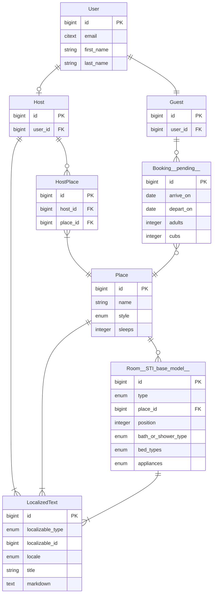

# BearBnB

BearBnB is an AirBnB clone for bears to demonstrate building a Dream/Psychic application complicated enough to leverage several of the powerful features of Dream and Psychic (including STI, polymorphism, has-many-through, serializers in addition to the default and summary serializers, soft-delete, and sortable).

A good way to follow along with building a Psychic app is:

1. Have PostgreSQL and Redis running (e.g. by `brew install postgres` `brew install redis` & following post-install instructions for each)
2. Create a new Psychic app with `npx @rvoh/create-psychic bearbnb`.
3. Start with the third commit in the [BearBnB commits](https://github.com/rvohealth/bearbnb/commits/main/) (`Generate User model`).
4. Then follow along with the changes, commit by commit, making the changes in your project. The commits are broken down into generated code and hand coded features, and the commit message includes generator commands that were run.

## Entity Relationship Diagram (ERD) of the BearBnB model domain



## Generator commands used to create BearBnB

```sh
yarn psy g:model --no-serializer User email:citext first_name:citext last_name:citext
yarn psy g:model Guest User:belongs_to
yarn psy g:model Host User:belongs_to
yarn psy g:resource --owning-model=Host v1/host/places Place name:citext style:enum:place_styles:cottage,cabin,lean_to,treehouse,tent,cave,dump
yarn psy g:model --no-serializer HostPlace Host:belongs_to Place:belongs_to deleted_at:datetime:optional

yarn psy g:resource --sti-base-serializer --owning-model=Place v1/host/places/rooms Room type:enum:room_types:Bathroom,Bedroom,Kitchen,Den,
yarn psy g:sti-child --help
yarn psy g:sti-child Room/Bathroom extends Room bath_or_shower_type:enum:bath_or_shower_types:bath,shower,bath_and_shower,none:optional
yarn psy g:sti-child Room/Bedroom extends Room bed_types:enum:bed_types:twin,bunk,queen,king,cot,sofabed
yarn psy g:sti-child Room/Kitchen extends Room appliances:enum:appliance_types:stove,oven,microwave,dishwasher
yarn psy g:sti-child Room/Den extends Room
yarn psy g:sti-child Room/LivingRoom extends Room

yarn psy g:resource --only=update,destroy v1/host/localized-texts LocalizedText localizable_type:enum:localized_types:Host,Place,Room
yarn psy g:controller V1/Guest/Places index


# pending future work
yarn psy g:resource v1/guest/stays Booking Guest:belongs_to Place:belongs_to arrive_on:date depart_on:date adults:integer cubs:integer
```
