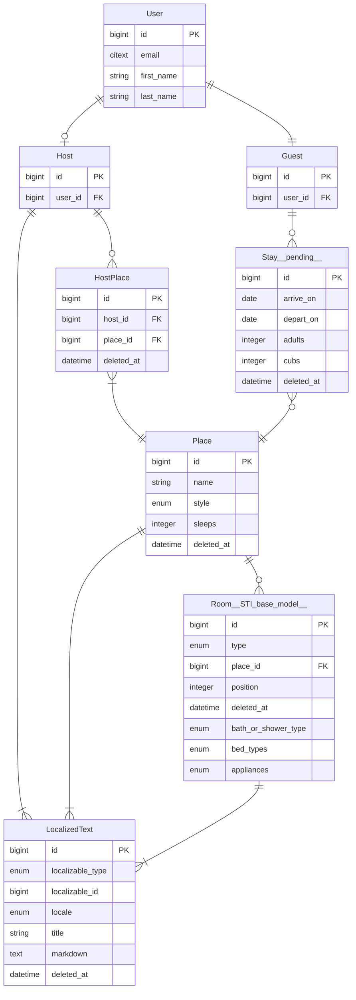

# BearBnB

An AirBnB clone for bears to demonstrate [Dream ORM](https://github.com/rvohealth/dream) and [Psychic web framework](https://github.com/rvohealth/psychic).

A good way to follow along with building a new Psychic app is:

1. Have PostgreSQL and Redis running (e.g. by `brew install postgres` `brew install redis` & following post-install instructions for each)
2. Create a new Psychic app with `npx @rvoh/create-psychic bearbnb`.
3. Start with the third commit in this repo (`Generate User model`).
4. Then follow along with the changes, commit by commit, making the changes in your project. The commits are broken down into generated code and hand coded features, and the commit message includes generator commands that were run. [This YouTube video](https://www.youtube.com/watch?v=dag9YVMXqGM) walks through the commits in this project, explaining each step. **NOTE: several steps in the video are no longer necessary since the generators now support array attributes and nested resources.**

Full guides available at [https://psychicframework.com/](https://psychicframework.com/).

## Running specs locally

Create file `.env.test` in the `api` directory:

```
DB_USER=<your PostgreSQL username>
DB_NAME=bearbnb_test
DB_PORT=5432
DB_HOST=localhost
APP_ENCRYPTION_KEY="RpCuTrH6fz+yKpxLJPUjsKoIlz+aHO79N5hI3o1oVSU="
TZ=UTC
```

Then:

```bash
yarn psy db:create
yarn psy db:migrate
yarn uspec
```

## State of the repo

The client apps (end user and admin) are merely the default apps generated by Vite. End-to-end feature specs will be added later to flesh out those apps.

## Entity Relationship Diagram (ERD) of the BearBnB model domain



## Generator commands used to create BearBnB

```bash
yarn psy g:model --no-serializer User email:citext
yarn psy g:model Guest User:belongs_to
yarn psy g:model Host User:belongs_to
yarn psy g:resource --owning-model=Host v1/host/places Place name:citext style:enum:place_styles:cottage,cabin,lean_to,
yarn psy g:model --no-serializer HostPlace Host:belongs_to Place:belongs_to deleted_at:datetime:optional

yarn psy g:resource --sti-base-serializer --owning-model=Place v1/host/places/\{\}/rooms Room type:enum:room_types:Bathroom,
yarn psy g:sti-child Room/Bathroom extends Room bath_or_shower_style:enum:bath_or_shower_styles:bath,shower,bath_and_shower,
yarn psy g:sti-child --help
yarn psy g:sti-child Room/Bedroom extends Room bed_types:enum\[\]:bed_types:twin,bunk,queen,king,cot,sofabed
yarn psy g:sti-child Room/Kitchen extends Room appliances:enum\[\]:appliance_types:stove,oven,microwave,dishwasher
yarn psy g:sti-child Room/Den extends Room
yarn psy g:sti-child Room/LivingRoom extends Room

yarn psy g:resource --only=update,destroy v1/host/localized-texts LocalizedText localizable_type:enum:localized_types:Host,
yarn psy g:controller V1/Guest/Places index show
yarn psy g:migration add-deferrable-unique-constraint-to-rooms

# pending future work
yarn psy g:resource v1/guest/stays Booking Guest:belongs_to Place:belongs_to arrive_on:date depart_on:date adults:integer cubs:integer deleted_at:date:optional
```
