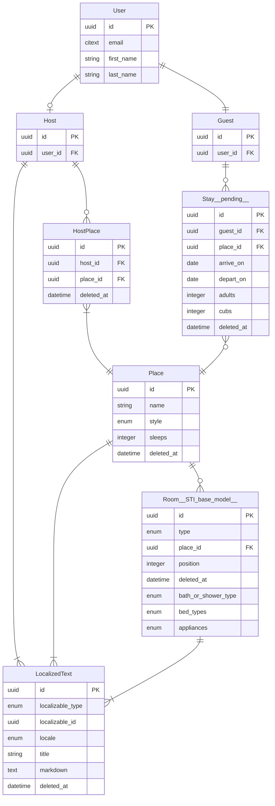

import PackageManagerTabs from '@site/src/components/ui/package-manager-tabs'

# BearBnB

An AirBnB clone for bears to demonstrate [Dream ORM](https://github.com/rvohealth/dream) and [Psychic web framework](https://github.com/rvohealth/psychic).

A good way to follow along with building a new Psychic app is:

1. Have PostgreSQL and Redis running (e.g. by `brew install postgres` `brew install redis` & following post-install instructions for each)
2. Create a new Psychic app with `npx @rvoh/create-psychic bearbnb`.
3. Start with the third commit in this repo (`Generate User model`).
4. Then follow along with the changes, commit by commit, making the changes in your project. The commits are broken down into generated code and hand coded features, and the commit message includes generator commands that were run. [This YouTube video](https://www.youtube.com/watch?v=dag9YVMXqGM) walks through the commits in this project, explaining each step. **NOTE: several steps in the video are no longer necessary since the generators now support array attributes and nested resources.**

Full guides available at [https://psychicframework.com/](https://psychicframework.com/).

### AI

AI rules for developing a Dream and Psychic application are provided in `./api/AGENTS.md`\*. These rules may be customized by adding to the bottom of the file (a rule exists in the file to instruct AI to add new rules outside of the official Psychic rules).

To fetch the current version of the AI rules:

<PackageManagerTabs code={`{{PM}} psy sync:ai-rules`} />

\* if this Psychic app was created without a front-end client, then these files are in the project root

## Running specs locally

Create file `.env.test` in the `api` directory:

```
DB_USER=<your PostgreSQL username>
DB_NAME=bearbnb_test
DB_PORT=5432
DB_HOST=localhost
APP_ENCRYPTION_KEY="RpCuTrH6fz+yKpxLJPUjsKoIlz+aHO79N5hI3o1oVSU="
TZ=UTC
```

Then run the database setup and unit specs. These `psy` commands default to the test environment, so they target the test database unless you explicitly set `NODE_ENV=development`.

<PackageManagerTabs
  code={`{{PM}} psy db:create
{{PM}} psy db:migrate
{{PM}} uspec`}
/>

## State of the repo

The client apps (end user and admin) are merely the default apps generated by Vite. End-to-end feature specs will be added later to flesh out those apps.

## Entity Relationship Diagram (ERD) of the BearBnB model domain



## Generator commands used to create BearBnB

<PackageManagerTabs
  code={`{{PM}} psy g:model --no-serializer User email:citext
{{PM}} psy g:model Guest User:belongs_to
{{PM}} psy g:model Host User:belongs_to
{{PM}} psy g:resource --owning-model=Host v1/host/places Place name:citext style:enum:place_styles:cottage,cabin,lean_to,treehouse,tent,cave,dump sleeps:integer
{{PM}} psy g:model --no-serializer HostPlace Host:belongs_to Place:belongs_to

{{PM}} psy g:resource --sti-base-serializer --owning-model=Place v1/host/places/\\{\\}/rooms Room type:enum:room_types:Bathroom,Bedroom,Kitchen,Den,LivingRoom Place:belongs_to position:integer:optional
{{PM}} psy g:sti-child --help
{{PM}} psy g:sti-child Room/Bathroom extends Room bath_or_shower_style:enum:bath_or_shower_styles:bath,shower,bath_and_shower,none
{{PM}} psy g:sti-child Room/Bedroom extends Room bed_types:enum\\[\\]:bed_types:twin,bunk,queen,king,cot,sofabed
{{PM}} psy g:sti-child Room/Kitchen extends Room appliances:enum\\[\\]:appliance_types:stove,oven,microwave,dishwasher
{{PM}} psy g:sti-child Room/Den extends Room
{{PM}} psy g:sti-child Room/LivingRoom extends Room

{{PM}} psy g:resource --only=update,destroy v1/host/localized-texts LocalizedText localizable_type:enum:localized_types:Host,Place,Room localizable_id:uuid locale:enum:locales:en-US,es-ES title:string markdown:text
{{PM}} psy g:controller V1/Visitor/Places index show
{{PM}} psy g:migration add-deferrable-unique-constraint-to-rooms

# pending future work
{{PM}} psy g:resource v1/guest/stays Booking Guest:belongs_to Place:belongs_to arrive_on:date depart_on:date adults:integer cubs:integer`}
/>
