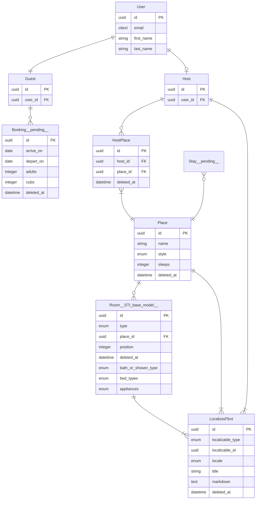

import PackageManagerTabs from '@site/src/components/ui/package-manager-tabs'

# BearBnB

An AirBnB clone for bears to demonstrate [Dream ORM](https://github.com/rvohealth/dream) and [Psychic web framework](https://github.com/rvohealth/psychic).

A good way to follow along with building a new Psychic app is:

1. Have PostgreSQL and Redis running.
2. Create a new Psychic app with `npx @rvoh/create-psychic new bearbnb`.
3. Start with the third commit in this repo (`Generate User model`).
4. Then follow along with the changes, commit by commit, making the changes in your project. The commits are broken down into generated code and hand coded features, and commit messages include generator commands that were run.

Full guides available at [https://psychicframework.com/](https://psychicframework.com/).

### AI

This project ships with AI tooling for Dream and Psychic development.

**Psychic-skill** — If you chose to install the psychic-skill during setup, it provides comprehensive rules and conventions for Dream and Psychic development. Codex reads it from `.agents/skills/psychic-skill`. When you selected both Claude and Codex, that is the single committed copy and `.claude/skills/psychic-skill` references it (a symlink repaired on `install` by a root `postinstall`, or a real copy under npm); Claude Code loads it automatically either way.

**AI rules** — `./api/CLAUDE.md` and `./api/AGENTS.md`\* direct your agent to the **psychic-skill**, which is the single source of truth for Dream and Psychic conventions, patterns, and rules. Update the skill itself (via `/psychic-update-skill` or `git fetch origin && git reset --hard origin/main && ./setup` inside the skill directory) to get the latest guidance.

\* if this Psychic app was created without a front-end client, then these files are in the project root

## Running specs locally

Create file `.env.test` in the `api` directory:

```
DB_USER=<your PostgreSQL username>
DB_NAME=bearbnb_test
DB_PORT=5432
DB_HOST=localhost
APP_ENCRYPTION_KEY="RpCuTrH6fz+yKpxLJPUjsKoIlz+aHO79N5hI3o1oVSU="
TZ=UTC
```

Then:

<PackageManagerTabs
  code={`cd api
{{PM}} psy db:create
{{PM}} psy db:migrate
{{PM}} uspec`}
/>

## State of the repo

To see feature specs and end user front end application, check out the `frontend` branch.

## Entity Relationship Diagram (ERD) of the BearBnB model domain


```mermaid
erDiagram
  User {
    uuid id PK
    citext email
    string first_name
    string last_name
  }

  Guest {
    uuid id PK
    uuid user_id FK
  }

  Host {
    uuid id PK
    uuid user_id FK
  }

  Place {
    uuid id PK
    string name
    enum style
    integer sleeps
    datetime deleted_at
  }

  HostPlace {
    uuid id PK
    uuid host_id FK
    uuid place_id FK
    datetime deleted_at
  }

  Room__STI_base_model__ {
    uuid id PK
    enum type
    uuid place_id FK
    integer position
    datetime deleted_at

    enum bath_or_shower_type
    enum bed_types
    enum appliances
  }

  LocalizedText {
    uuid id PK
    enum localizable_type
    uuid localizable_id
    enum locale
    string title
    text markdown
    datetime deleted_at
  }

  Booking__pending__ {
    uuid id PK
    date arrive_on
    date depart_on
    integer adults
    integer cubs
    datetime deleted_at
  }

  User ||--|| Guest : ""
  User ||--o| Host : ""
  Guest ||--o{ Booking__pending__ : ""
  Host ||--o{ HostPlace : ""
  HostPlace }|--|| Place : ""
  Place ||--o{ Room__STI_base_model__ : ""
  Host ||--|{ LocalizedText : ""
  Place ||--|{ LocalizedText : ""
  Room__STI_base_model__ ||--|{ LocalizedText : ""
  Stay__pending__ }o--|| Place : ""
```

## Generator commands used to create BearBnB

<PackageManagerTabs
  code={`{{PM}} psy g:model --no-serializer User email:citext phone:encrypted
{{PM}} psy g:model Guest User:belongs_to
{{PM}} psy g:model Host User:belongs_to
{{PM}} psy g:resource --owning-model=Host v1/host/places Place name:citext style:enum:place_styles:cottage,cabin,lean_to,treehouse,tent,cave,dump sleeps:integer
{{PM}} psy g:model --no-serializer HostPlace Host:belongs_to Place:belongs_to

{{PM}} psy g:resource --sti-base-serializer --owning-model=Place 'v1/host/places/\\{\\}/rooms' Room type:enum:room_types:Bathroom,Bedroom,Kitchen,Den,LivingRoom Place:belongs_to position:integer:optional
{{PM}} psy g:sti-child --model-name=Bathroom Room/Bathroom extends Room bath_or_shower_style:enum:bath_or_shower_styles:bath,shower,bath_and_shower,none
{{PM}} psy g:sti-child --model-name=Bedroom Room/Bedroom extends Room 'bed_types:enum\\[\\]:bed_types:twin,bunk,queen,king,cot,sofabed'
{{PM}} psy g:sti-child --model-name=Kitchen Room/Kitchen extends Room 'appliances:enum\\[\\]:appliance_types:stove,oven,microwave,dishwasher'
{{PM}} psy g:sti-child --model-name=Den Room/Den extends Room
{{PM}} psy g:sti-child --model-name=LivingRoom Room/LivingRoom extends Room

{{PM}} psy g:resource --only=update,destroy v1/host/localized-texts LocalizedText localizable_type:enum:localized_types:Host,Place,Room localizable_id:uuid locale:enum:locales:en-US,es-ES title:string markdown:text
{{PM}} psy g:controller Visitor/V1/Places index show

{{PM}} psy g:migration add-deleted-at-to-rooms deleted_at:datetime:optional
{{PM}} psy g:migration add-deferrable-unique-constraint-to-rooms

{{PM}} psy g:migration add-firebase-uid-to-users firebase_uid:string:optional
{{PM}} psy g:migration allow-null-phone-on-users

{{PM}} psy g:resource --only=index,create,destroy --owning-model=Guest v1/guest/favorites Favorite Guest:belongs_to Place:belongs_to
{{PM}} psy g:resource --only=index,create,update,destroy --owning-model=Guest v1/guest/bookings Booking Guest:belongs_to Place:belongs_to starts_on:date ends_on:date
{{PM}} psy g:resource --only=index,create,update,destroy --owning-model=Guest v1/guest/reviews Review Booking:belongs_to rating:integer body:text
{{PM}} psy g:controller Visitor/V1/Places/Reviews index`}
/>
