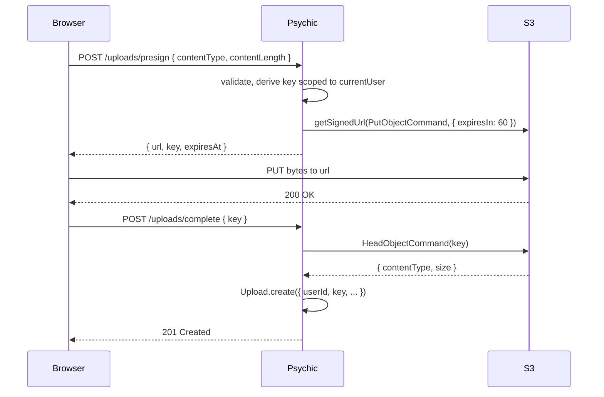

# File Uploads

For almost every Psychic app, the right default for file uploads is a **presigned URL to object storage** (S3, Cloudflare R2, GCS). The bytes never touch the Psychic server, which eliminates an entire class of bugs: path traversal, unbounded disk writes, polyglot files, and app-tier malware scanning. **Local handling is a fallback** for legacy apps, air-gapped deployments, regulatory data-residency constraints, or synchronous transform pipelines (ffmpeg, imagemagick) that need a real file on disk.

## Presigned URL flow (recommended)

The browser asks Psychic for a short-lived, narrowly-scoped URL. The browser PUTs the bytes directly to object storage. The browser tells Psychic it finished, and Psychic verifies the upload and persists a Dream row. Psychic never reads the file contents.



### 1. Issue the presigned URL

Install the AWS SDK bits you need:

```sh
pnpm add @aws-sdk/client-s3 @aws-sdk/s3-request-presigner
```

The `presign` action validates what the client says it is about to upload, derives a server-owned key (the client never picks the key), and returns a short-lived signed URL:

```ts
import { AuthedController, OpenAPI } from '@rvoh/psychic'
import { S3Client, PutObjectCommand } from '@aws-sdk/client-s3'
import { getSignedUrl } from '@aws-sdk/s3-request-presigner'
import crypto from 'node:crypto'

const ALLOWED_CONTENT_TYPES = ['image/jpeg', 'image/png', 'image/webp'] as const
const MAX_BYTES = 10 * 1024 * 1024 // 10 MB

const s3 = new S3Client({ region: process.env.AWS_REGION })

export default class UploadsController extends AuthedController {
  @OpenAPI({
    status: 201,
    tags: ['uploads'],
    description: 'Issue a short-lived presigned URL for a direct-to-S3 upload',
  })
  public async presign() {
    const contentType = this.castParam('contentType', 'string', {
      enum: ALLOWED_CONTENT_TYPES as unknown as string[],
    })
    const contentLength = this.castParam('contentLength', 'integer')

    if (contentLength <= 0 || contentLength > MAX_BYTES) {
      this.badRequest('contentLength out of range')
      return
    }

    const key = `uploads/${this.currentUser.id}/${crypto.randomUUID()}`

    const url = await getSignedUrl(
      s3,
      new PutObjectCommand({
        Bucket: process.env.UPLOADS_BUCKET,
        Key: key,
        ContentType: contentType,
        ContentLength: contentLength,
      }),
      { expiresIn: 60 },
    )

    this.created({
      url,
      key,
      expiresAt: new Date(Date.now() + 60_000).toISOString(),
    })
  }
}
```

Two things to notice:

1. The `key` is derived server-side and scoped under the authenticated user's id. The client cannot smuggle in `../someone-else/secret.png`.
2. The `ContentType` and `ContentLength` are baked into the signature. If the browser tries to PUT different bytes or a different media type, S3 rejects the request before Psychic ever sees it.

### 2. Verify and persist

After the browser completes its PUT, it POSTs the `key` back. The server asks S3 to describe the object it just stored, confirms it matches what we signed, and writes a Dream row:

```ts
import { HeadObjectCommand } from '@aws-sdk/client-s3'
import Upload from '../../models/Upload.js'

export default class UploadsController extends AuthedController {
  // ... presign() above

  @OpenAPI({
    status: 201,
    tags: ['uploads'],
    description: 'Verify a presigned upload completed and persist a row',
  })
  public async complete() {
    const key = this.castParam('key', 'string')

    if (!key.startsWith(`uploads/${this.currentUser.id}/`)) {
      this.forbidden()
      return
    }

    const head = await s3.send(
      new HeadObjectCommand({
        Bucket: process.env.UPLOADS_BUCKET,
        Key: key,
      }),
    )

    const size = head.ContentLength ?? 0
    const contentType = head.ContentType ?? ''

    if (size <= 0 || size > MAX_BYTES) {
      this.badRequest('size out of range')
      return
    }
    if (!ALLOWED_CONTENT_TYPES.includes(contentType as (typeof ALLOWED_CONTENT_TYPES)[number])) {
      this.badRequest('unexpected contentType')
      return
    }

    const upload = await Upload.create({
      userId: this.currentUser.id,
      key,
      contentType,
      size,
    })

    this.created(upload)
  }
}
```

Any client-supplied metadata that was not in the signature (display filename, captions, EXIF) should be treated as untrusted input and stored in its own Dream column, never used as a filesystem path.

### IAM

The Psychic server's IAM role needs `s3:PutObject` for signing, plus `s3:HeadObject` and `s3:GetObject` for verification and later reads, all scoped to the one bucket and the `uploads/*` key prefix:

```json
{
  "Version": "2012-10-17",
  "Statement": [
    {
      "Effect": "Allow",
      "Action": ["s3:PutObject", "s3:GetObject", "s3:HeadObject"],
      "Resource": "arn:aws:s3:::my-app-uploads/uploads/*"
    }
  ]
}
```

The browser never receives raw AWS credentials. It receives a URL that works for a single PUT of a specific `Content-Type` and `Content-Length` to a specific key, for sixty seconds.

### R2, GCS, tus

The same pattern works everywhere; only the SDK changes.

- **Cloudflare R2.** `@aws-sdk/client-s3` with an `endpoint` override pointing at your R2 account. Everything else in the controller above is unchanged.
- **Google Cloud Storage.** `@google-cloud/storage` ships a `file.getSignedUrl({ action: 'write', expires, contentType })` helper.
- **Resumable, large, flaky-network uploads.** `tus-node-server` implements the tus protocol and is the right fit when you're moving multi-gigabyte files from a phone on a train. It runs as its own process; Psychic only stores the completed object reference.

## Local handling (fallback)

Reach for this when:

- You're porting a legacy app that already writes to a local disk and can't migrate the storage layer yet.
- You're deployed air-gapped or under data-residency regulation that forbids commercial object-storage providers.
- You need a synchronous transform pipeline that expects a real path, e.g. `ffmpeg -i /tmp/xxx.mov` or `imagemagick` reading from disk before the request completes.
- The blobs are very small and the round trip through S3 adds unacceptable latency.

Otherwise, go back to the presigned URL flow above.

### Pick a parser

Multipart parsing is not one of Psychic's defaults. The app installs and wires a parser at the routing layer:

```sh
pnpm add @koa/multer multer
```

Both `@koa/multer` (wrapping `multer`) and `koa-body` (wrapping `formidable`) default to writing incoming files to `os.tmpdir()` with a random filename. **Do not override that default with the client-supplied filename.** If the original display filename matters for later download, store it as a Dream column; never use it as the on-disk name.

```ts
// conf/routes.ts
import multer from '@koa/multer'

const upload = multer({
  // leave destination and filename alone — the defaults are random + safe
  limits: {
    fileSize: 10 * 1024 * 1024, // 10 MB
    files: 1,
  },
})

export default (r: PsychicRouter) => {
  r.post('/uploads', upload.single('file'), async (ctx, next) => {
    // ctx.request.file.path is a random path under os.tmpdir()
    // ctx.request.file.originalname is UNTRUSTED — store it, do not exec() on it
    await next()
  }, 'UploadsController#create')
}
```

### If you genuinely need a client-influenced path

Sometimes a subdirectory name has to come from the client — a project slug, an album id. Resolve defensively and assert the result stayed inside the base directory:

```ts
import path from 'node:path'
import fs from 'node:fs/promises'

const baseDir = path.resolve('/var/app/uploads')

export async function storeAt(candidate: string, bytes: Buffer) {
  // strip any directory components from the candidate first
  const safeName = path.basename(candidate)
  const resolved = path.resolve(baseDir, safeName)

  if (!resolved.startsWith(baseDir + path.sep)) {
    const err = new Error('invalid path')
    ;(err as Error & { status?: number }).status = 400
    throw err
  }

  await fs.writeFile(resolved, bytes)
  return resolved
}
```

`path.basename` strips any `../` segments the client tried to include, `path.resolve` collapses anything they still managed to smuggle through, and the `startsWith` assertion catches edge cases around symlinks and case-insensitive filesystems.

### Size limits

Enforce at the parser, not at Psychic's body parser. Psychic wraps `koa-bodyparser`, whose defaults (`jsonLimit: '1mb'`, `formLimit: '56kb'`) **do not apply to multipart requests** — those bypass `koa-bodyparser` entirely and go to whatever multipart parser you wired in. The size limit lives on `multer`'s `limits.fileSize` or `formidable`'s `maxFileSize`.

For context on the body-parser defaults and how to override them, see [psychic config](../config/psychic.mdx).

### Serving uploads back

Even for locally-stored files, prefer a storage-layer signed URL for downloads so the app server does not sit in the bytes path. If you must re-serve inline through a controller, two things matter:

- Psychic sets `X-Content-Type-Options: nosniff` on responses by default, so browsers won't sniff an `image/png` response into `text/html`.
- For any type the browser could interpret (HTML, SVG, XML, anything executable), add `Content-Disposition: attachment` so it is saved instead of rendered in-origin:

```ts
public async download() {
  const upload = await Upload.findOrFail(this.castParam('id', 'bigint'))
  this.ctx.set('Content-Type', upload.contentType)
  this.ctx.set('Content-Disposition', `attachment; filename="${upload.id}"`)
  this.ctx.body = fs.createReadStream(upload.localPath)
}
```

## Threat model notes

The presigned-URL path makes most of this moot by removing the app server from the bytes path. Path traversal can't happen because the server derives the key and the client never touches the filesystem. Unbounded disk writes can't happen because there is no app-tier disk write. Polyglot files (a JPEG that is also a valid HTML document) are still a concern at the browser layer, but Psychic's default `X-Content-Type-Options: nosniff` header and an explicit `Content-Disposition: attachment` for risky types close the remaining gap. When you do need local handling, the parser's default random-filename behavior is the safe path — the client-supplied-filename code path only opens if you actively wire it in. For the body-parser side of the picture, see [psychic config](../config/psychic.mdx).
